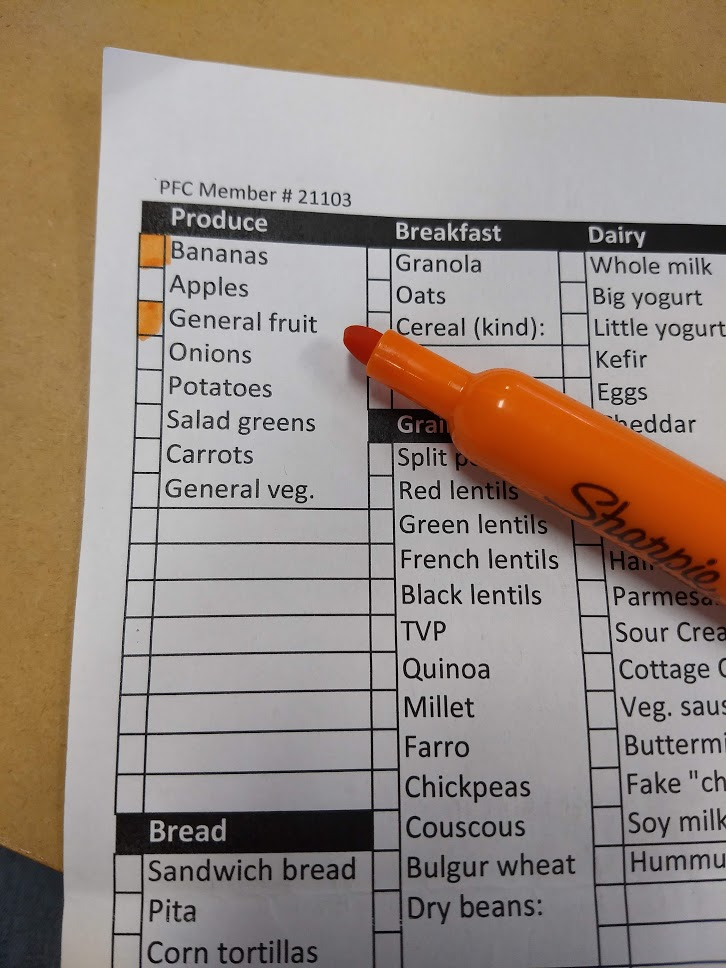

# grocery-list
Customizable, printable check-off grocery list

## What
A grocery list, made from a spreadsheet, that prints on a single page.

## Why
- Solves the problem of looking in the pantry to see what's *not* there
- Pen and paper > another app
- Customize based on what you buy and how the store is organized

## How
- Print on the back of already-printed-on paper
- Color in the squares adjacent to the items you need
- Cross off as you go, circle items you didn't get and still need
- After shopping, copy over any outstanding items to the next list
- Meal ideas go in the whitespace at the bottom

### Why GitHub
In case people aren't comfortable opening an Excel file from the internet, this makes it more transparent who it was edited by and when.

This grocery list is licensed under a [Creative Commons BY-NC-SA 4.0 license](https://creativecommons.org/licenses/by-nc-sa/4.0/).  Feel free to edit and reshare it within those restrictions.
